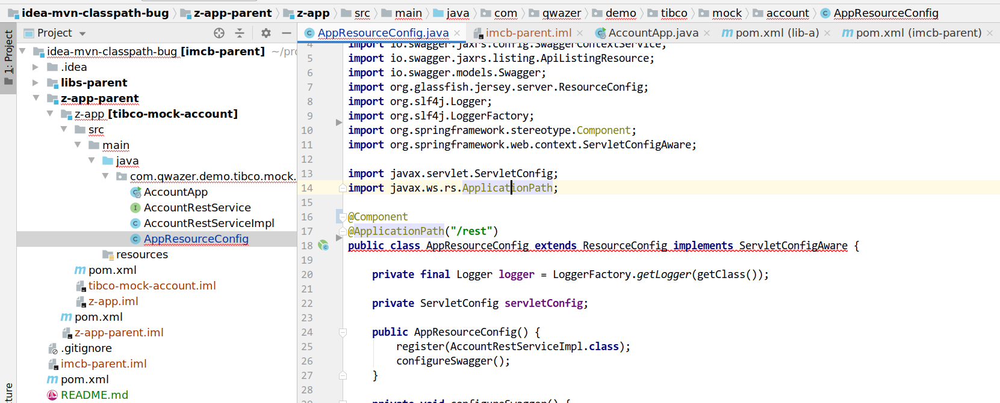

## What's this?

This is demo project to show bug in IDEA.


## What steps will reproduce the issue?

1. Open project in IDEA and import maven project
2. Open file AppResourceConfig

What is the expected result?
no errors.

What happens instead?

Error
```
'getConfiguration()' in 'org.glassfish.jersey.server.ResourceConfig' clashes with 'getConfiguration()' in 'javax.ws.rs.core.Configurable'; attempting to use incompatible return type
```




## Possible causes

Possible cause is classpath hell of jersey lib in multi=module java project and mix of different scopes in single classpath.

Can be w/a in different ways

1. By excluding of old verson of jersey lib in lib-a module.  Note, that in lib-a it used in test scope, why it is added to compile scope of nearby lib?

2. renaming of z-app to a-app. In this case classpath order will change I guess.


## Additional info


IDEA version

```
IntelliJ IDEA 2019.2.1 (Ultimate Edition)
Build #IU-192.6262.58, built on August 20, 2019
```
